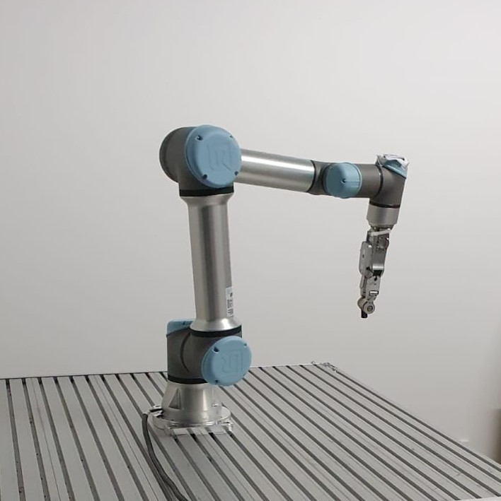
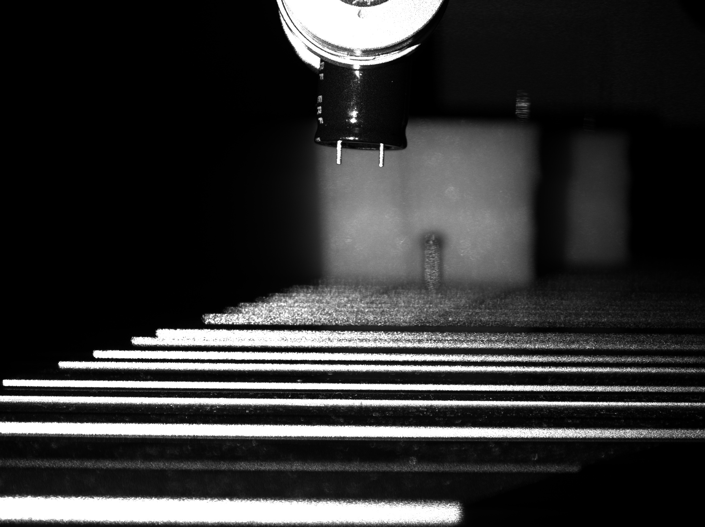
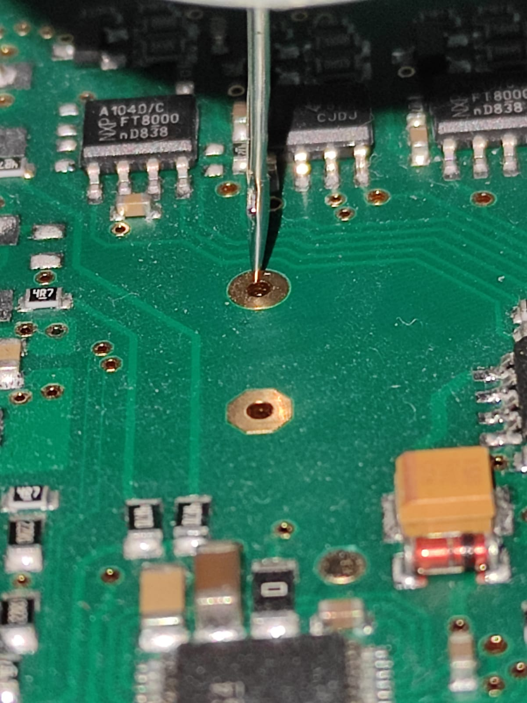
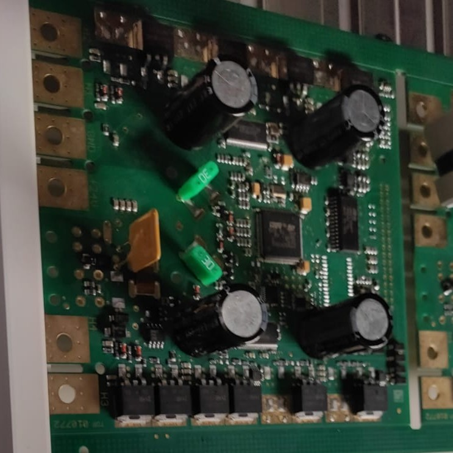

# THT_Bestueckung

## Description
This is a project that was implemented to automatically place THT components on a board. 
Here a cobot from Universal Robot with the RG2-FT gripper from OnRobot was used.
The components were gripped, then the wires were detected by machine vision and with this information and the defined hole position on the board, the components could be placed. 
A camera from Photoneo was used.
Various capacitors and fuses were successfully placed.

## Example pictures

### Test Station
In this picture you can see the test setup used. 

### Grayimage
This image is an example of the image taken for a component. 

### Detected wires
Here you can see how the wires were detected in the captured image

### Detection Check
To check the accuracy of the detection we used a needle as a wire and then drove to the desired hole. As you can see we have achieved a very high accuracy.

### Placed Parts
On this picture you can see after one run all successfully placed components

